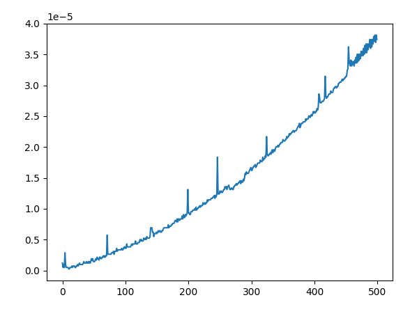

# Puissance :

cette algorithme permet de calculer de calculer la a à la puissance n. Les préconditions sont : 
- n >= 0 
- type(n) = E(n)

Avec : 
- n => la puissance à la quelle nous souhaitons élevé a
- a le float que nous élevons à la puissance superieur

Les conditions d'arrêts sont lorsque l'opération est lorsque que : 
> notre variable que l'on incrémente s'arrête à n 
```python
import time
import matplotlib.pyplot as plt
 
def Power(a,n):
    t = time.time()
    pwr,i = a,1
    if type(n)==float or n < 0:
        return "ERROR, entier naturels uniquement"   
    for i in range(1,n):            
        pwr = pwr * a
    return pwr, time.time()-t

max = 100
a = 2
labels = [x for x in range(max)]
values = [Power(a,x) for x in range(max)]
plt.plot(labels, values,)
plt.show() 
```
la complexité de cette algorithme est de n car nous faison n dois cette boucle pour obtenir notre variable :



Il y à quelques pique mais nous voyons que la durée d'exécution du programme est linéaire